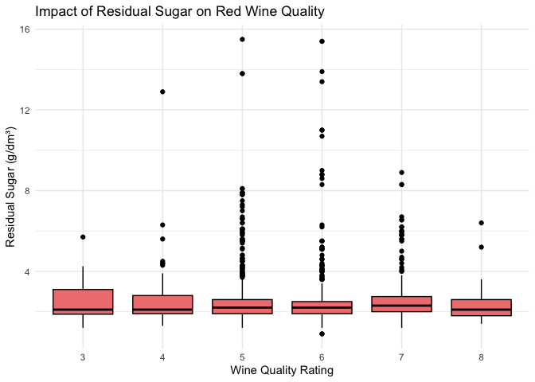
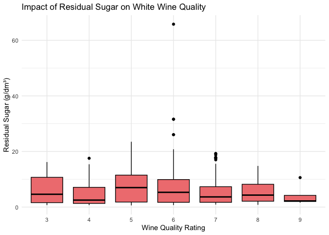
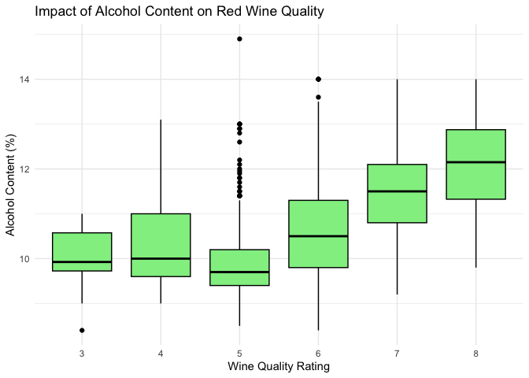
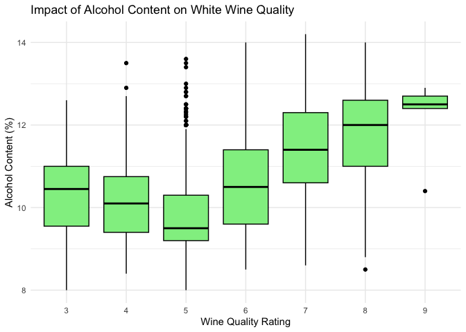

README
================

    ## ── Attaching core tidyverse packages ──────────────────────── tidyverse 2.0.0 ──
    ## ✔ dplyr     1.1.4     ✔ readr     2.1.5
    ## ✔ forcats   1.0.0     ✔ stringr   1.5.1
    ## ✔ ggplot2   3.5.1     ✔ tibble    3.2.1
    ## ✔ lubridate 1.9.4     ✔ tidyr     1.3.1
    ## ✔ purrr     1.0.4     
    ## ── Conflicts ────────────────────────────────────────── tidyverse_conflicts() ──
    ## ✖ dplyr::filter() masks stats::filter()
    ## ✖ dplyr::lag()    masks stats::lag()
    ## ℹ Use the conflicted package (<http://conflicted.r-lib.org/>) to force all conflicts to become errors

## Business Understanding

The first step in the data science process according to CRISP-DM is to do some research to gather a business understanding by assessing industry trends and defining the business objectives, meaning what the customer wants to accomplish. Once you have obtained this understanding, you can determine your goals of what kind of insights you hope to extract from the data.

To develop this business understanding, I did research on what makes a good quality wine. From my research, I found an article on the website of a reputable wine company: <https://www.jjbuckley.com/wine-knowledge/blog/the-4-factors-and-4-indicators-of-wine-quality/1009?srsltid=AfmBOopyyzH5XasQn6mkq-2gzgv1O9Y0sXLNl5oosC8edVn05_4JiQ2N>

This article provides a concise and easily understandable overview of four factors that contribute to wine quality as well as four factors that indicate wine quality.

The four factors listed that contribute to wine quality are climate and weather, temperature and sunlight, growing practices (removing extra leaves and shoots, harvesting early, late, or on time), and winemaking practices (maceration, fermentation, extraction, and aging). An important part of winemaking practices that can affect the quality of the wine is inputs such as sulfur dioxide. This is necessary for preservation, but too much of it can hurt the flavor of the wine.

The four indicators of wine quality listed are complexity of flavor profile, balance of the five flavor components (acidity, tannins, sugar/sweetness, alochol, and fruit), typicity (how much the wine looks and tastes as it should based on its type), and intensity and finish.

This business understanding process helped me to develop the goals to extract insights about alcohol content, acidity, sulfur dioxide, chlorides, density, and residual sugar from the data set.

Alcohol content can provide information about the fermentation aspect of the winemaking process as well as the balance of the five flavor components (alcohol is one). Density of wine is also impacted by alchohol content, so these could be studied together.

Acidity (fixed acidity, volatile acidity, citric acid) can also provide information about the balance of the five flavor components.

Sulfur dioxide can provide information about winemaking practices.

Chloride content depends on the wine’s origin, so it can provide information about climate and weather.

Residual sugar can also provide information about the balance of the five flavor components.

## Data Understanding

### Summary of Red and White Wine Datasets

| Dataset | Samples | Features | Feature_Names |
|:---|---:|---:|:---|
| Red Wine | 1599 | 12 | fixed.acidity, volatile.acidity, citric.acid, residual.sugar, chlorides, free.sulfur.dioxide, total.sulfur.dioxide, density, pH, sulphates, alcohol, quality |
| White Wine | 4898 | 12 | fixed.acidity, volatile.acidity, citric.acid, residual.sugar, chlorides, free.sulfur.dioxide, total.sulfur.dioxide, density, pH, sulphates, alcohol, quality |

### Data Types for Red Wine Dataset

| Feature              | Data_Type |
|:---------------------|:----------|
| fixed.acidity        | numeric   |
| volatile.acidity     | numeric   |
| citric.acid          | numeric   |
| residual.sugar       | numeric   |
| chlorides            | numeric   |
| free.sulfur.dioxide  | numeric   |
| total.sulfur.dioxide | numeric   |
| density              | numeric   |
| pH                   | numeric   |
| sulphates            | numeric   |
| alcohol              | numeric   |
| quality              | integer   |

### Data Types for White Wine Dataset

| Feature              | Data_Type |
|:---------------------|:----------|
| fixed.acidity        | numeric   |
| volatile.acidity     | numeric   |
| citric.acid          | numeric   |
| residual.sugar       | numeric   |
| chlorides            | numeric   |
| free.sulfur.dioxide  | numeric   |
| total.sulfur.dioxide | numeric   |
| density              | numeric   |
| pH                   | numeric   |
| sulphates            | numeric   |
| alcohol              | numeric   |
| quality              | integer   |

## Data Preparation

When loading the data, I had to be sure that I included sep = “;” so that R would read the dataset correctly based on the correct delimiter rather than treating the entire line as a single string.

I also checked for missing values and found that there were none:

    ## [1] 0

    ## [1] 0

I also looked at the summary statistics to better understand the data:

### Summary Statistics for Red Wine Dataset

|  | fixed.acidity | volatile.acidity | citric.acid | residual.sugar | chlorides | free.sulfur.dioxide | total.sulfur.dioxide | density | pH | sulphates | alcohol | quality |
|:---|:---|:---|:---|:---|:---|:---|:---|:---|:---|:---|:---|:---|
|  | Min. : 4.60 | Min. :0.1200 | Min. :0.000 | Min. : 0.900 | Min. :0.01200 | Min. : 1.00 | Min. : 6.00 | Min. :0.9901 | Min. :2.740 | Min. :0.3300 | Min. : 8.40 | Min. :3.000 |
|  | 1st Qu.: 7.10 | 1st Qu.:0.3900 | 1st Qu.:0.090 | 1st Qu.: 1.900 | 1st Qu.:0.07000 | 1st Qu.: 7.00 | 1st Qu.: 22.00 | 1st Qu.:0.9956 | 1st Qu.:3.210 | 1st Qu.:0.5500 | 1st Qu.: 9.50 | 1st Qu.:5.000 |
|  | Median : 7.90 | Median :0.5200 | Median :0.260 | Median : 2.200 | Median :0.07900 | Median :14.00 | Median : 38.00 | Median :0.9968 | Median :3.310 | Median :0.6200 | Median :10.20 | Median :6.000 |
|  | Mean : 8.32 | Mean :0.5278 | Mean :0.271 | Mean : 2.539 | Mean :0.08747 | Mean :15.87 | Mean : 46.47 | Mean :0.9967 | Mean :3.311 | Mean :0.6581 | Mean :10.42 | Mean :5.636 |
|  | 3rd Qu.: 9.20 | 3rd Qu.:0.6400 | 3rd Qu.:0.420 | 3rd Qu.: 2.600 | 3rd Qu.:0.09000 | 3rd Qu.:21.00 | 3rd Qu.: 62.00 | 3rd Qu.:0.9978 | 3rd Qu.:3.400 | 3rd Qu.:0.7300 | 3rd Qu.:11.10 | 3rd Qu.:6.000 |
|  | Max. :15.90 | Max. :1.5800 | Max. :1.000 | Max. :15.500 | Max. :0.61100 | Max. :72.00 | Max. :289.00 | Max. :1.0037 | Max. :4.010 | Max. :2.0000 | Max. :14.90 | Max. :8.000 |

### Summary Statistics for White Wine Dataset

|  | fixed.acidity | volatile.acidity | citric.acid | residual.sugar | chlorides | free.sulfur.dioxide | total.sulfur.dioxide | density | pH | sulphates | alcohol | quality |
|:---|:---|:---|:---|:---|:---|:---|:---|:---|:---|:---|:---|:---|
|  | Min. : 3.800 | Min. :0.0800 | Min. :0.0000 | Min. : 0.600 | Min. :0.00900 | Min. : 2.00 | Min. : 9.0 | Min. :0.9871 | Min. :2.720 | Min. :0.2200 | Min. : 8.00 | Min. :3.000 |
|  | 1st Qu.: 6.300 | 1st Qu.:0.2100 | 1st Qu.:0.2700 | 1st Qu.: 1.700 | 1st Qu.:0.03600 | 1st Qu.: 23.00 | 1st Qu.:108.0 | 1st Qu.:0.9917 | 1st Qu.:3.090 | 1st Qu.:0.4100 | 1st Qu.: 9.50 | 1st Qu.:5.000 |
|  | Median : 6.800 | Median :0.2600 | Median :0.3200 | Median : 5.200 | Median :0.04300 | Median : 34.00 | Median :134.0 | Median :0.9937 | Median :3.180 | Median :0.4700 | Median :10.40 | Median :6.000 |
|  | Mean : 6.855 | Mean :0.2782 | Mean :0.3342 | Mean : 6.391 | Mean :0.04577 | Mean : 35.31 | Mean :138.4 | Mean :0.9940 | Mean :3.188 | Mean :0.4898 | Mean :10.51 | Mean :5.878 |
|  | 3rd Qu.: 7.300 | 3rd Qu.:0.3200 | 3rd Qu.:0.3900 | 3rd Qu.: 9.900 | 3rd Qu.:0.05000 | 3rd Qu.: 46.00 | 3rd Qu.:167.0 | 3rd Qu.:0.9961 | 3rd Qu.:3.280 | 3rd Qu.:0.5500 | 3rd Qu.:11.40 | 3rd Qu.:6.000 |
|  | Max. :14.200 | Max. :1.1000 | Max. :1.6600 | Max. :65.800 | Max. :0.34600 | Max. :289.00 | Max. :440.0 | Max. :1.0390 | Max. :3.820 | Max. :1.0800 | Max. :14.20 | Max. :9.000 |

From the summary statistics in the data preparation step above, it looked like residual sugar, free sulfur dioxide, and total sulfur dioxide might have some large outliers, so I did some research and found that this is quite common and has real-world explanations tied to winemaking practices and wine styles. Outliers in residual sugar values can be explained by dessert wines or off-dry whites, which are styles with high residual sugar. A large range of values in free suflur dioxide can be explained by the large difference in free sulfur dioxide between white and red wine. Finally, the large outliers in total sulfur dioxide can be explained by wines with long shelf-life goals, because wines meant to last years may have higher sulfur dioxide content to ensure stability.

Due to this research, I determined that I was not concerned about outliers and could proceed.

## Modeling + Evaluating

Based on prior knowledge from the business understanding step, I want to ask about how residual sugar and alcohol content affect the quality of wine. So, I am doing EDA for each of these questions.

### Check assumptions before performing EDA

Normality of groups:

    ## redwine_data$quality_factor: 3
    ## 
    ##  Shapiro-Wilk normality test
    ## 
    ## data:  dd[x, ]
    ## W = 0.9423, p-value = 0.5788
    ## 
    ## ------------------------------------------------------------ 
    ## redwine_data$quality_factor: 4
    ## 
    ##  Shapiro-Wilk normality test
    ## 
    ## data:  dd[x, ]
    ## W = 0.93444, p-value = 0.00607
    ## 
    ## ------------------------------------------------------------ 
    ## redwine_data$quality_factor: 5
    ## 
    ##  Shapiro-Wilk normality test
    ## 
    ## data:  dd[x, ]
    ## W = 0.84302, p-value < 2.2e-16
    ## 
    ## ------------------------------------------------------------ 
    ## redwine_data$quality_factor: 6
    ## 
    ##  Shapiro-Wilk normality test
    ## 
    ## data:  dd[x, ]
    ## W = 0.96945, p-value = 2.885e-10
    ## 
    ## ------------------------------------------------------------ 
    ## redwine_data$quality_factor: 7
    ## 
    ##  Shapiro-Wilk normality test
    ## 
    ## data:  dd[x, ]
    ## W = 0.99166, p-value = 0.3108
    ## 
    ## ------------------------------------------------------------ 
    ## redwine_data$quality_factor: 8
    ## 
    ##  Shapiro-Wilk normality test
    ## 
    ## data:  dd[x, ]
    ## W = 0.96336, p-value = 0.6676

    ## whitewine_data$quality_factor: 3
    ## 
    ##  Shapiro-Wilk normality test
    ## 
    ## data:  dd[x, ]
    ## W = 0.98279, p-value = 0.9648
    ## 
    ## ------------------------------------------------------------ 
    ## whitewine_data$quality_factor: 4
    ## 
    ##  Shapiro-Wilk normality test
    ## 
    ## data:  dd[x, ]
    ## W = 0.9599, p-value = 0.0001216
    ## 
    ## ------------------------------------------------------------ 
    ## whitewine_data$quality_factor: 5
    ## 
    ##  Shapiro-Wilk normality test
    ## 
    ## data:  dd[x, ]
    ## W = 0.92085, p-value < 2.2e-16
    ## 
    ## ------------------------------------------------------------ 
    ## whitewine_data$quality_factor: 6
    ## 
    ##  Shapiro-Wilk normality test
    ## 
    ## data:  dd[x, ]
    ## W = 0.9666, p-value < 2.2e-16
    ## 
    ## ------------------------------------------------------------ 
    ## whitewine_data$quality_factor: 7
    ## 
    ##  Shapiro-Wilk normality test
    ## 
    ## data:  dd[x, ]
    ## W = 0.97704, p-value = 1.512e-10
    ## 
    ## ------------------------------------------------------------ 
    ## whitewine_data$quality_factor: 8
    ## 
    ##  Shapiro-Wilk normality test
    ## 
    ## data:  dd[x, ]
    ## W = 0.90786, p-value = 5.193e-09
    ## 
    ## ------------------------------------------------------------ 
    ## whitewine_data$quality_factor: 9
    ## 
    ##  Shapiro-Wilk normality test
    ## 
    ## data:  dd[x, ]
    ## W = 0.73193, p-value = 0.02007

    ## redwine_data$quality_factor: 3
    ## 
    ##  Shapiro-Wilk normality test
    ## 
    ## data:  dd[x, ]
    ## W = 0.83472, p-value = 0.03813
    ## 
    ## ------------------------------------------------------------ 
    ## redwine_data$quality_factor: 4
    ## 
    ##  Shapiro-Wilk normality test
    ## 
    ## data:  dd[x, ]
    ## W = 0.59115, p-value = 6.597e-11
    ## 
    ## ------------------------------------------------------------ 
    ## redwine_data$quality_factor: 5
    ## 
    ##  Shapiro-Wilk normality test
    ## 
    ## data:  dd[x, ]
    ## W = 0.58182, p-value < 2.2e-16
    ## 
    ## ------------------------------------------------------------ 
    ## redwine_data$quality_factor: 6
    ## 
    ##  Shapiro-Wilk normality test
    ## 
    ## data:  dd[x, ]
    ## W = 0.48133, p-value < 2.2e-16
    ## 
    ## ------------------------------------------------------------ 
    ## redwine_data$quality_factor: 7
    ## 
    ##  Shapiro-Wilk normality test
    ## 
    ## data:  dd[x, ]
    ## W = 0.72073, p-value < 2.2e-16
    ## 
    ## ------------------------------------------------------------ 
    ## redwine_data$quality_factor: 8
    ## 
    ##  Shapiro-Wilk normality test
    ## 
    ## data:  dd[x, ]
    ## W = 0.7214, p-value = 0.0001432

    ## whitewine_data$quality_factor: 3
    ## 
    ##  Shapiro-Wilk normality test
    ## 
    ## data:  dd[x, ]
    ## W = 0.86595, p-value = 0.009983
    ## 
    ## ------------------------------------------------------------ 
    ## whitewine_data$quality_factor: 4
    ## 
    ##  Shapiro-Wilk normality test
    ## 
    ## data:  dd[x, ]
    ## W = 0.82884, p-value = 1.542e-12
    ## 
    ## ------------------------------------------------------------ 
    ## whitewine_data$quality_factor: 5
    ## 
    ##  Shapiro-Wilk normality test
    ## 
    ## data:  dd[x, ]
    ## W = 0.92237, p-value < 2.2e-16
    ## 
    ## ------------------------------------------------------------ 
    ## whitewine_data$quality_factor: 6
    ## 
    ##  Shapiro-Wilk normality test
    ## 
    ## data:  dd[x, ]
    ## W = 0.8717, p-value < 2.2e-16
    ## 
    ## ------------------------------------------------------------ 
    ## whitewine_data$quality_factor: 7
    ## 
    ##  Shapiro-Wilk normality test
    ## 
    ## data:  dd[x, ]
    ## W = 0.84151, p-value < 2.2e-16
    ## 
    ## ------------------------------------------------------------ 
    ## whitewine_data$quality_factor: 8
    ## 
    ##  Shapiro-Wilk normality test
    ## 
    ## data:  dd[x, ]
    ## W = 0.86819, p-value = 3.025e-11
    ## 
    ## ------------------------------------------------------------ 
    ## whitewine_data$quality_factor: 9
    ## 
    ##  Shapiro-Wilk normality test
    ## 
    ## data:  dd[x, ]
    ## W = 0.75035, p-value = 0.02999

Some of the p-values were high but most were below 0.05, which means that the data is not likely normally distributed, so we should proceed with non-paramteric tests to test statistical significance.

### EDA for Residual sugar

Question: Does residual sugar significantly affect wine quality?

Non-parametric test for signficance:

    ## 
    ##  Kruskal-Wallis rank sum test
    ## 
    ## data:  residual.sugar by quality_factor
    ## Kruskal-Wallis chi-squared = 6.8262, df = 5, p-value = 0.2339

    ## 
    ##  Kruskal-Wallis rank sum test
    ## 
    ## data:  residual.sugar by quality_factor
    ## Kruskal-Wallis chi-squared = 94.519, df = 6, p-value < 2.2e-16

p-value \< 0.05 -\> reject the null hypothesis that residual sugar does not affect wine quality

<!-- --><!-- -->

Result: Residual sugar does not seem to effect wine quality rating. All the boxplots are concentrated at the bottom and have outliers with high residual sugar content. This is probably due to the differences in wine types I described above, with dessert wines probably being the outliers with higher sugar content.

### EDA for Alcohol content

Question: Does alcohol content significantly affect wine quality?

Non-parametric test for signficance:

    ## 
    ##  Kruskal-Wallis rank sum test
    ## 
    ## data:  alcohol by quality_factor
    ## Kruskal-Wallis chi-squared = 412.38, df = 5, p-value < 2.2e-16

    ## 
    ##  Kruskal-Wallis rank sum test
    ## 
    ## data:  alcohol by quality_factor
    ## Kruskal-Wallis chi-squared = 1014.1, df = 6, p-value < 2.2e-16

p-value \< 0.05 -\> reject the null hypothesis that alcohol content does not affect wine quality

<!-- --><!-- -->

Findings: Alcohol content does seem to effect wine quality rating. Higher rated wines seem to have a higher alcohol content. This result is statistically significant.

## Conclusion

I have extracted an actionable insight for my wine producer costumer, which is that wine with higher alcohol content receives a higher quality rating. From this insight, my customer can adjust the fermentation aspect of their winemaking process as well as the balance of the five flavor components, in order to create wine with a higher alcohol content in order to receive higher quality rankings.
